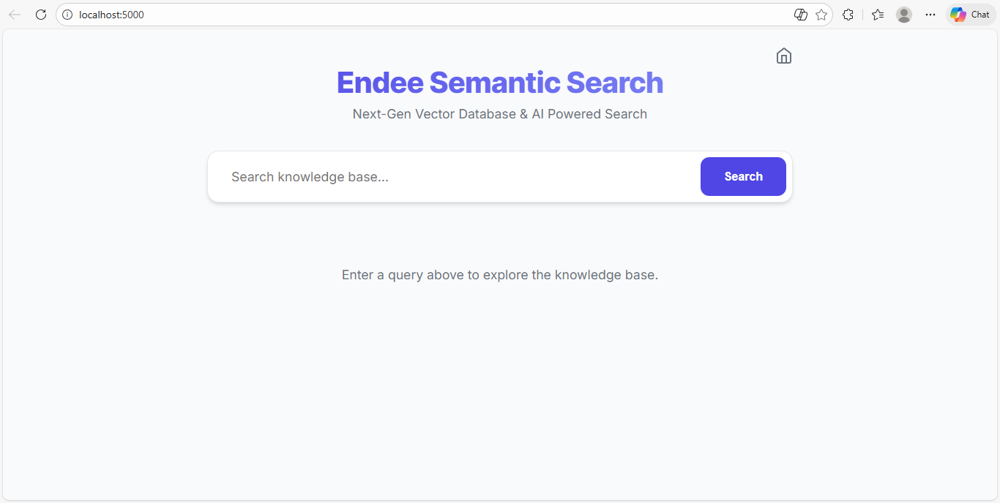
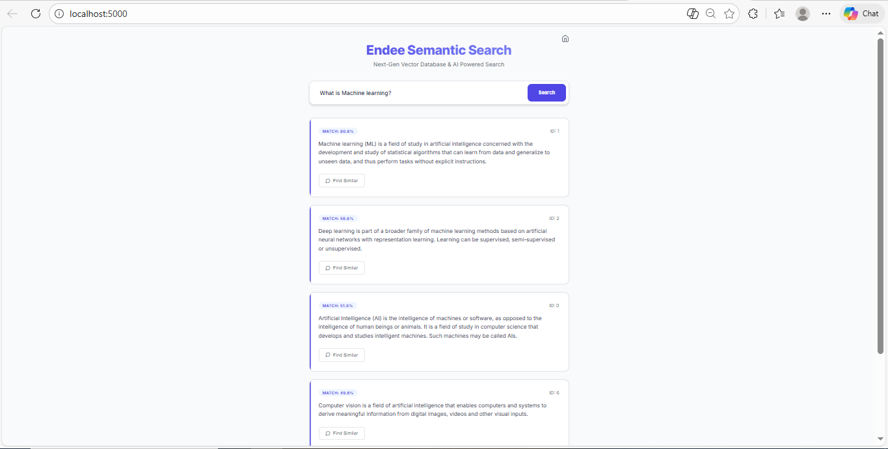
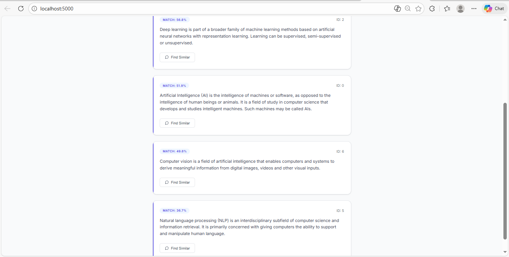
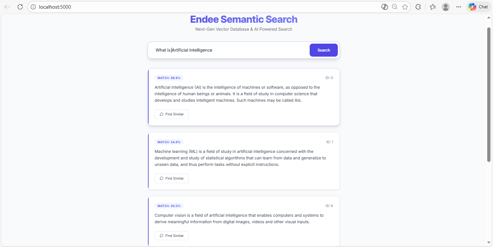
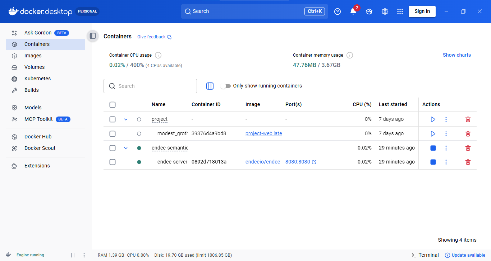
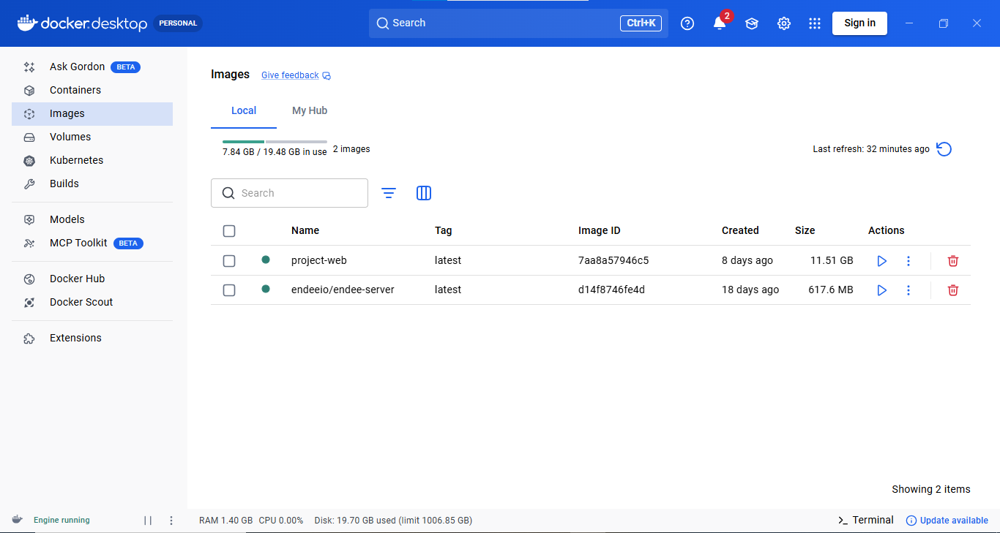
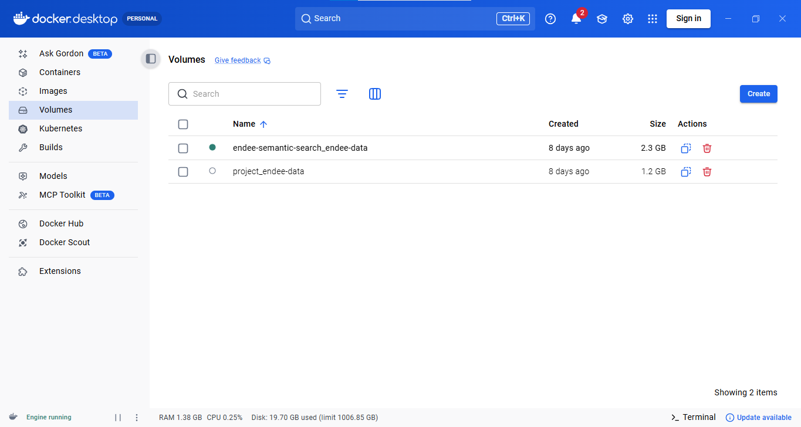
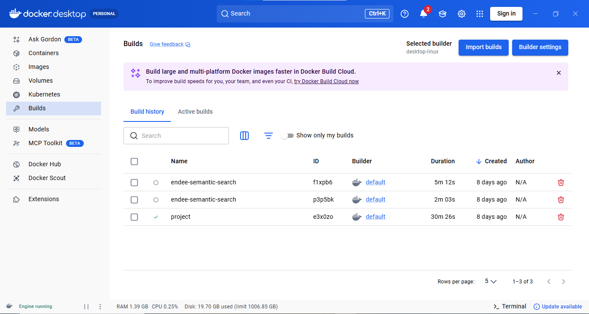
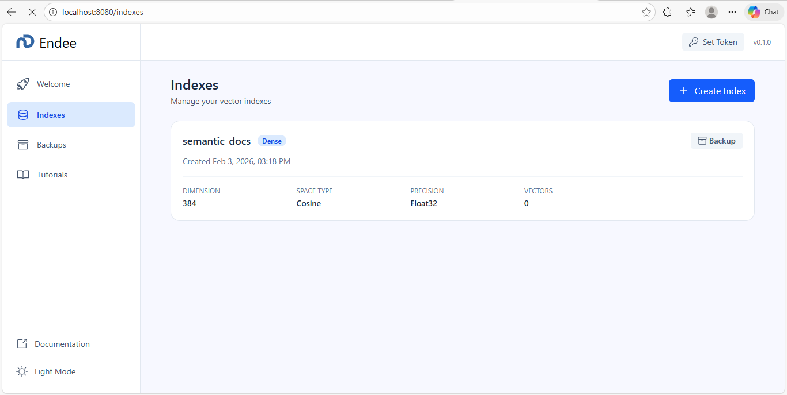

# Semantic Search Project

This AI application implements a high-performance **Semantic Search** system powered by the ** Vector Database**. It enables searching through text documents based on their underlying meaning and intent, rather than relying solely on literal keyword matching.

## Key Features

- **Semantic Vector Search**: Uses state-of-the-art embeddings to find relevant content even when search terms don't match exactly.
- **Similarity Recommendations**: "Find Similar" feature to explore related segments of the knowledge base.
- **High-Performance Storage**: Leverages for sub-millisecond vector retrieval.
- **Premium UI**: Modern, responsive interface with real-time match scores.

## 📸 App Screenshots 
<table> 
   <tr> 
      <td align="center"> 
         <h4>🟣 Search Home</h4> 
          
      </td> 
      <td align="center"> 
         <h4>🟣 Search Results</h4> 
          
      </td> 
   </tr> 
   <tr> 
      <td align="center"> 
         <h4>🟣 Similarity Recommendation</h4>
         
      </td> <td align="center"> 
         <h4>🟣 Ranked Semantic Matches</h4>
          
      </td> 
   </tr>
</table> 

## Technical Approach

### Architecture
- **Vector Database**: Endee (Latest Docker Image).
- **Backend API**: Python 3.8+ (Flask).
- **AI Model**: `sentence-transformers/all-MiniLM-L6-v2` (384-dimension embeddings).
- **Frontend**: Premium Single Page Application (HTML5/CSS3/JS).

### Data Flow & Improvements
1. **Intelligent Ingestion**:
   - Documents are chunked by meaningful paragraphs.
   - The system automatically **drops and recreates** the Endee index on each ingestion to ensure a clean, optimized state.
2. **Accurate Scoring**:
   - The backend uses Endee's **Cosine Similarity** space.
   - Scores are normalized to user-friendly percentages (e.g., "Match: 95%").

## Setup & Running

### 1. Prerequisites
- [Docker Desktop](https://www.docker.com/products/docker-desktop/) (must be running).
- Python 3.8+.

### 2. Quick Start (Windows)
We provide a launcher for easy setup:
```powershell
./run_on_windows.bat
```
This script will start the Endee container, check dependencies, and launch the API at `http://localhost:5000`.

### 3. Ingest Data
Once the database is up, load the sample documents:
```bash
python backend/ingest.py
```

### 4. Access the Application
Open `frontend/index.html` in your browser. Try queries like:
- *"Artificial Intelligence"*
- *"How do vector databases work?"*
- *"Neural Networks"* (to test semantic matching)

## 🐳 Docker Environment Details

The application is fully containerized for consistent deployment. Below is the current environment state:

### Containers & Services
| Service Name | Image | Port Mapping | Status |
| :--- | :--- | :--- | :--- |
| **server** | `endeeio/endee-server:latest` | `8080:8080` | Running |
| **project-web** | `project-web:latest` | `5000:5000` | Running |

### Volumes & Persistence
| Volume Name | Purpose | Size |
| :--- | :--- | :--- |
| `endee-semantic-search_endee-data` | Endee Vector Storage | ~2.3 GB |
| `project_endee-data` | Legacy/Backup DB Data | ~1.2 GB |

## 🐳 Docker Infrastructure View
<table> 
   <tr> 
      <td align="center"> 
         <h4>🟣 Container Status</h4> 
         
      </td> 
      <td align="center"> 
         <h4>🟣 Image Registry</h4> 
         
      </td> 
   </tr> 
   <tr> 
      <td align="center"> 
         <h4>🟣 Volume Persistence</h4> 
        
      </td> 
      <td align="center"> 
         <h4>🟣 Build History</h4> 
         
      </td> 
   </tr> 
</table>

## 🚀 Endee Vector Management

The **Endee Dashboard** provides a powerful interface for managing vector indexes, monitoring performance, and overseeing data persistence.
Overview of the <b>semantic_docs</b> vector index configured with 384-dimensional embeddings and cosine similarity for semantic search.
<table> 
   <tr> 
      <td align="center"> 
         <h4>🟣 Index Overview</h4> 
         
         <p><i>Real-time monitoring of the <b>semantic_docs</b> index (384 Dimensions, Cosine Space).
      </td> 
   </tr> 
</table>


## Project Structure
```
├── backend/
│   ├── app.py              # Flask Search & Recommend API
│   ├── ingest.py           # Data ingestion & Index management
│   ├── endee_client.py     # Endee REST API wrapper
│   └── doc_map.json        # Document metadata mapping
├── frontend/
│   └── index.html          # Premium Search UI
├── data/
│   └── sample.txt          # Source knowledge base content
├── docker-compose.yml      # Endee Service configuration
└── run_on_windows.bat      # Automated Launcher
```

## How Vector Database is Used
 serves as the core engine for this project. We interact with its API to:
- **Manage Collections**: Dynamically create and drop indexes.
- **Vector Storage**: Store 384-dimension document embeddings with JSON payloads.
- **Vector Search**: Perform lightning-fast cosine similarity searches for query vectors.
